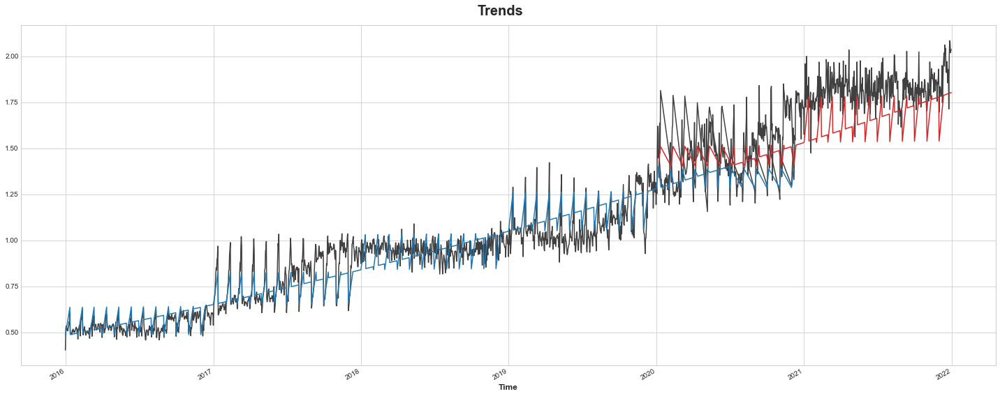
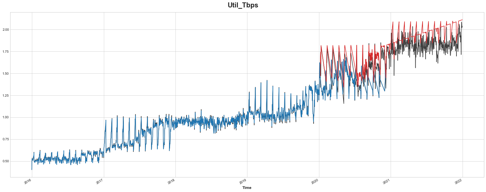

```python
import numpy as np
import pandas as pd
from warnings import simplefilter
import matplotlib.pyplot as plt
%matplotlib inline
simplefilter("ignore")
```


```python
df=pd.read_csv('DailyTraffic.csv')
```


```python
df.head()
```


<div>

<table border="1" class="dataframe">
  <thead>
    <tr style="text-align: right;">
      <th></th>
      <th>Time</th>
      <th>Util_Tbps</th>
    </tr>
  </thead>
  <tbody>
    <tr>
      <th>0</th>
      <td>01/01/2016</td>
      <td>0.403441</td>
    </tr>
    <tr>
      <th>1</th>
      <td>02/01/2016</td>
      <td>0.463106</td>
    </tr>
    <tr>
      <th>2</th>
      <td>03/01/2016</td>
      <td>0.467094</td>
    </tr>
    <tr>
      <th>3</th>
      <td>04/01/2016</td>
      <td>0.471649</td>
    </tr>
    <tr>
      <th>4</th>
      <td>05/01/2016</td>
      <td>0.475212</td>
    </tr>
  </tbody>
</table>
</div>


```python
df.tail()
```


<div>

<table border="1" class="dataframe">
  <thead>
    <tr style="text-align: right;">
      <th></th>
      <th>Time</th>
      <th>Util_Tbps</th>
    </tr>
  </thead>
  <tbody>
    <tr>
      <th>2187</th>
      <td>27/12/2021</td>
      <td>2.084657</td>
    </tr>
    <tr>
      <th>2188</th>
      <td>28/12/2021</td>
      <td>2.076491</td>
    </tr>
    <tr>
      <th>2189</th>
      <td>29/12/2021</td>
      <td>2.019331</td>
    </tr>
    <tr>
      <th>2190</th>
      <td>30/12/2021</td>
      <td>2.030922</td>
    </tr>
    <tr>
      <th>2191</th>
      <td>31/12/2021</td>
      <td>2.036961</td>
    </tr>
  </tbody>
</table>
</div>


```python
#showing count of null values
df['Util_Tbps'].isna().sum()
```


    0


```python
# ensure the Time col is datetime
df['Time']=pd.to_datetime(df['Time'])
```


```python
df.head()
```


<div>

<table border="1" class="dataframe">
  <thead>
    <tr style="text-align: right;">
      <th></th>
      <th>Time</th>
      <th>Util_Tbps</th>
    </tr>
  </thead>
  <tbody>
    <tr>
      <th>0</th>
      <td>2016-01-01</td>
      <td>0.403441</td>
    </tr>
    <tr>
      <th>1</th>
      <td>2016-02-01</td>
      <td>0.463106</td>
    </tr>
    <tr>
      <th>2</th>
      <td>2016-03-01</td>
      <td>0.467094</td>
    </tr>
    <tr>
      <th>3</th>
      <td>2016-04-01</td>
      <td>0.471649</td>
    </tr>
    <tr>
      <th>4</th>
      <td>2016-05-01</td>
      <td>0.475212</td>
    </tr>
  </tbody>
</table>
</div>


```python
df.describe()
```


<div>

<table border="1" class="dataframe">
  <thead>
    <tr style="text-align: right;">
      <th></th>
      <th>Util_Tbps</th>
    </tr>
  </thead>
  <tbody>
    <tr>
      <th>count</th>
      <td>2192.000000</td>
    </tr>
    <tr>
      <th>mean</th>
      <td>1.115121</td>
    </tr>
    <tr>
      <th>std</th>
      <td>0.442259</td>
    </tr>
    <tr>
      <th>min</th>
      <td>0.403441</td>
    </tr>
    <tr>
      <th>25%</th>
      <td>0.783865</td>
    </tr>
    <tr>
      <th>50%</th>
      <td>0.997920</td>
    </tr>
    <tr>
      <th>75%</th>
      <td>1.487910</td>
    </tr>
    <tr>
      <th>max</th>
      <td>2.084657</td>
    </tr>
  </tbody>
</table>
</div>


```python
# set the Time to index
df.set_index('Time', inplace=True)
```


```python
# visualize data
df.plot()
# we can notice trend+seasonality.
```


    <AxesSubplot:xlabel='Time'>


    

    


```python
from sklearn.linear_model import LinearRegression
from sklearn.model_selection import train_test_split
from statsmodels.tsa.deterministic import CalendarFourier, DeterministicProcess
from xgboost import XGBRegressor
```


```python
# Set Matplotlib defaults
plt.style.use("seaborn-whitegrid")
plt.rc(
    "figure",
    autolayout=True,
    figsize=(20, 8),
    titlesize=20,
    titleweight='bold',
)
plt.rc(
    "axes",
    labelweight="bold",
    labelsize="large",
    titleweight="bold",
    titlesize=16,
    titlepad=10,
)
plot_params = dict(
    color="0.75",
    style=".-",
    markeredgecolor="0.25",
    markerfacecolor="0.25",
)
```


```python
y = df.copy()

# Create trend features
dp = DeterministicProcess(
    index=y.index,  # dates from the training data
    constant=True,  # the intercept
    order=2,        # quadratic trend
    drop=True,      # drop terms to avoid collinearity
)
X = dp.in_sample()  # features for the training data

# split the date index instead of the dataframe directly.
idx_train, idx_test = train_test_split(
    y.index, test_size=0.25, shuffle=False,
)
# creat fit, test splits
X_train, X_test = X.loc[idx_train, :], X.loc[idx_test, :]
y_train, y_test = y.loc[idx_train], y.loc[idx_test]

# Fit trend model
model = LinearRegression(fit_intercept=False)
model.fit(X_train, y_train)

# Make predictions
y_fit = pd.DataFrame(
    model.predict(X_train),
    index=y_train.index,
    columns=y_train.columns,
)
y_pred = pd.DataFrame(
    model.predict(X_test),
    index=y_test.index,
    columns=y_test.columns,
)

# Plot
axs = y_train.plot(color='0.25', subplots=True, sharex=True)
axs = y_test.plot(color='0.25', subplots=True, sharex=True, ax=axs)
axs = y_fit.plot(color='C0', subplots=True, sharex=True, ax=axs)
axs = y_pred.plot(color='C3', subplots=True, sharex=True, ax=axs)
for ax in axs: ax.legend([])
_ = plt.suptitle("Trends")
```


    

    


```python
X=df
# Create splits
X_train, X_test = X.loc[idx_train, :], X.loc[idx_test, :]
y_train, y_test = y.loc[idx_train], y.loc[idx_test]

y_train=y_train.squeeze()  # training set
y_fit = y_fit.squeeze()    # trend from training set
y_pred = y_pred.squeeze()  # trend from test set

# Create residuals (the collection of detrended series) from the training set
y_resid = y_train - y_fit

# Train XGBoost on the residuals
xgb = XGBRegressor( n_estimators=1000) 
xgb.fit(X_train, y_resid)

# Add the predicted residuals onto the predicted trends
y_fit_boosted = xgb.predict(X_train) + y_fit
y_pred_boosted = xgb.predict(X_test) + y_pred

# Plot
axs = y_train.plot(
    color='0.25', figsize=(20, 8), subplots=True, sharex=True,
    title= 'Util_Tbps'
)
axs = y_test.plot(
    color='0.25', subplots=True, sharex=True, ax=axs,
)
axs = y_fit_boosted.plot(
    color='C0', subplots=True, sharex=True, ax=axs,
)
axs = y_pred_boosted.plot(
    color='C3', subplots=True, sharex=True, ax=axs,
)
for ax in axs: ax.legend([])
```


    

    


```python

```
